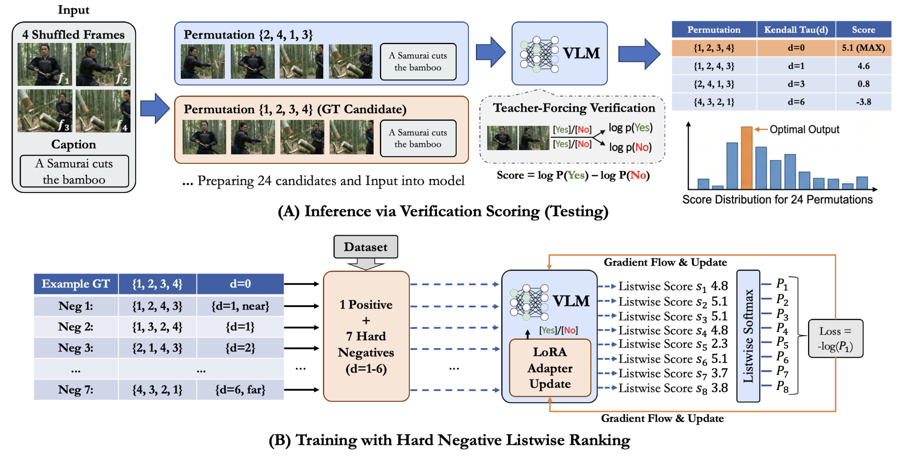
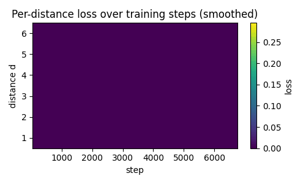
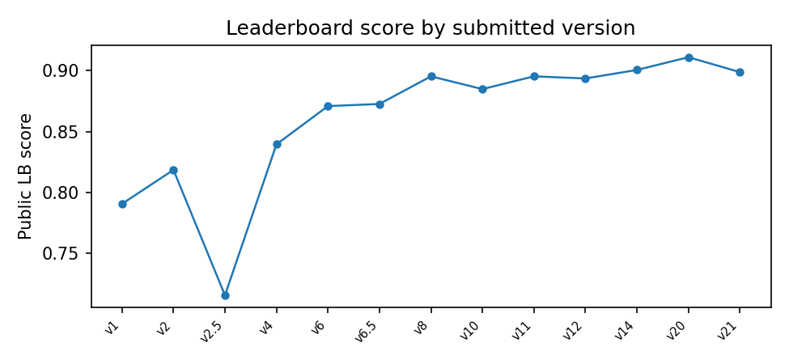
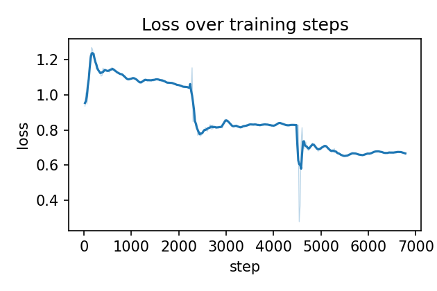
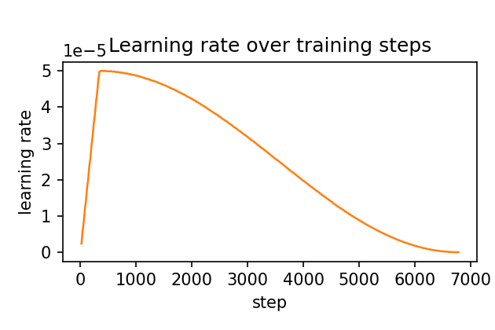
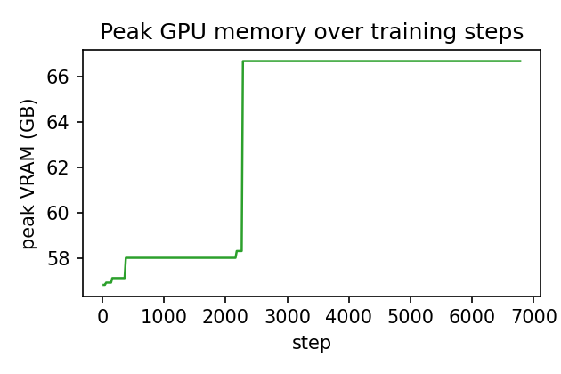
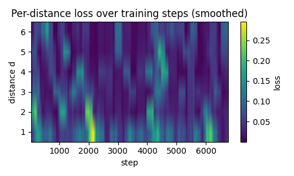
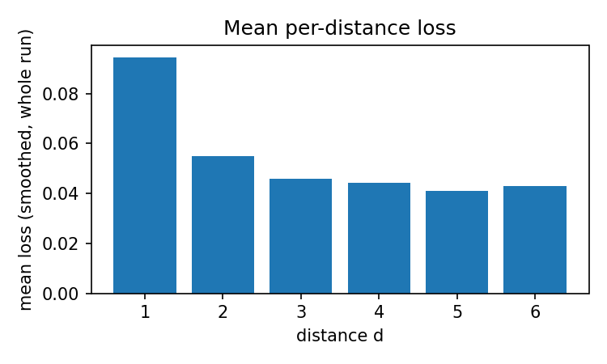
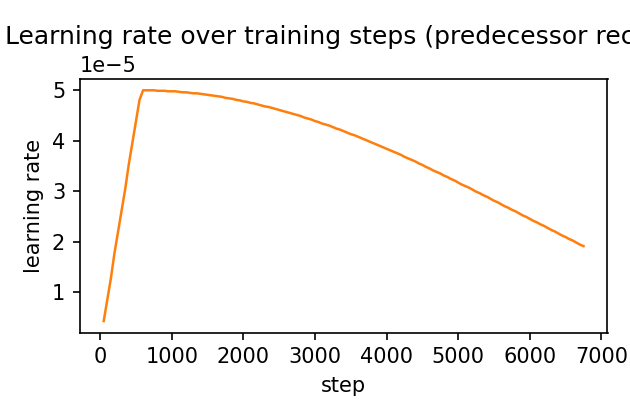

# TEMPO

**Temporal Event Matching via Permutation-scored Ordering**
Hard-Negative Listwise Ranking for Chronological Frame Reconstruction with Vision-Language Models

SNU AI Challenge 2026 · Kaggle `snuaichallenge` · Public **0.91099** / Private **0.90650**





**"텍스트로 풀어보는 장면의 재구성"** 출품 프로젝트입니다. 4장의 셔플된 비디오 프레임과, 그 프레임들이
담은 사건을 설명하는 문장(caption)이 주어졌을 때, 원래 사건의 올바른 시간 순서(4! = 24가지 경우의 수 중
1개)를 맞히는 과제입니다.

- **T**emporal: 시간 순서를 다루는 과제 본질
- **E**vent Matching: 문장(사건 설명)과 프레임 순서를 매칭
- **via** **P**ermutation-scored: 24개 순열을 전수조사하여 Yes/No 검증 점수(`log P(Yes) - log P(No)`)로 채점
- **Ordering**: 최종적으로 올바른 시간 순서를 결정
- (부제) **Hard-Negative Listwise Ranking**: 켄달타우 거리 기반으로 뽑은 hard negative들과 정답을 묶어
  8-way joint softmax(Plackett-Luce top-1)로 학습하는 `ListwiseSoftmaxLoss` — 이 프로젝트의 핵심 방법론

이 저장소는 예선 전 기간의 실험 히스토리(v1-v21)와, **예선 최종 제출 모델(v20)의 학습·추론 전체 코드
및 가중치**를 담고 있습니다. 코드 재현성 검증을 위해 제출된 저장소입니다.

> ## ⭐ 최종 제출 모델(재현 대상)은 `v20_32b_qlora/` 입니다
>
> - **모델**: Qwen3-VL-32B-Instruct + QLoRA(4bit NF4) LoRA 어댑터
> - **공식 리더보드 점수**: public **0.91099** / private **0.90650** (본 저장소 전체 21개 버전 중 최고점)
> - **이 결과를 만든 정확한 체크포인트**: `v20_32b_qlora/checkpoints/best_v20` (epoch 3, val exact-match
>   0.6176) — `config.py`에 이 체크포인트를 만든 하이퍼파라미터가 그대로 고정되어 있습니다.
> - **이 결과를 만든 정확한 제출 파일**: `v20_32b_qlora/submission_v20_best.csv`
> - v1-v19, v21은 이 최종 모델에 도달하기까지의 실험 히스토리이며, 최종 제출 모델이 아닙니다(§8 표 참고).
> - 본선 후보자 외부 데이터셋 검증도 **동일 체크포인트(best_v20)로 추가 학습 없이** 추론만 수행했습니다
>   (`v20_32b_qlora/inference_semifinal.py` → `submission_semifinal_v20.csv`).

---

## Quick Start — 재현 최소 명령어 (RTX 3090 / 대회 채점 서버 기준)

아래 순서 그대로 실행하면 `submission_v20_best.csv`가 재현됩니다. 1-3번은 인터넷이 되는 동안 한 번만
하면 되고, **4번(추론)부터는 인터넷 연결이 필요 없습니다** (대회 규정 3.1). 각 단계의 상세 설명은
아래 1-5번 섹션을 참고하세요.

```bash
# 0) 저장소 클론
git clone https://github.com/lky473736/snu-ai-challenge-2026.git
cd snu-ai-challenge-2026/v20_32b_qlora

# 1) 환경 구성 (RTX 3090 / CUDA 12.4 — 대회 채점 서버 기준, §1-2 참고)
conda create -n aichallenge python=3.10 -y
conda activate aichallenge
pip install torch==2.6.0 torchvision==0.21.0 --index-url https://download.pytorch.org/whl/cu124
pip install -r ../requirements.txt

# 2) 대회 데이터 배치 (§3 참고) — data/ 아래에 train.csv/test.csv/이미지가 위치하게 됨
python3 -c "import kagglehub; kagglehub.competition_download('snuaichallenge', output_dir='data')"

# 3) 베이스 모델 + LoRA 어댑터 가중치 다운로드 (§4 참고)
bash download_base_model.sh
bash download_weights.sh

# 4) 추론 실행 (인터넷 불필요) — GPU 1장에서 코드 수정 없이 그대로 동작 (§5.2-b 참고)
python inference.py
# 완료되면 v20_32b_qlora/submission_v20_best.csv 가 생성됩니다.
```

## 목차

1. [실행 환경](#1-실행-환경)
2. [설치](#2-설치)
3. [데이터 준비](#3-데이터-준비)
4. [모델 가중치](#4-모델-가중치)
5. [실행 방법](#5-실행-방법-최종-제출-모델-v20_32b_qlora)
6. [재현성 관련 참고사항](#6-재현성-관련-참고사항)
7. [코드 및 데이터 사용 관련 준수 사항](#7-코드-및-데이터-사용-관련-준수-사항)
8. [프로젝트 구조 (버전 히스토리 v1-v21)](#8-프로젝트-구조-버전-히스토리-v1-v21)
9. [라이선스](#9-라이선스)

---

## 1. 실행 환경

학습(4×H100)과 최종 제출 모델 재현(대회 규정상 RTX 3090 1장)은 **서로 다른 CUDA 환경**을 사용합니다.
아래 두 환경을 구분해서 설치하세요.

| 항목 | 값 |
|---|---|
| OS | Linux (SLURM 클러스터) |
| Python | 3.10.20 |
| GPU (학습) | NVIDIA H100 80GB × 4 (DDP, `accelerate`), CUDA 13.0, PyTorch 2.12.1+cu130 |
| GPU (최종 제출 모델 실행 요건) | NVIDIA RTX 3090 24GB × 1 (대회 규정 4번), driver 550.54.15, **CUDA 12.4** |

> **driver 550.54.15는 CUDA 12.4까지만 지원**하므로, RTX 3090 채점 서버에서는 CUDA 13.0용(cu130) PyTorch
> 휠이 설치되지 않습니다(드라이버가 요구 CUDA 런타임보다 낮아 초기화 실패). 이 재현 대상 환경에서는 반드시
> 아래 cu124 휠을 설치하세요.

### 주요 라이브러리 버전 (`requirements.txt`)

```
transformers==5.12.1
peft==0.19.1
accelerate==1.14.0
bitsandbytes==0.49.2
pandas==2.3.3
pillow==12.2.0
tqdm==4.68.3
safetensors==0.8.0
huggingface_hub==1.21.0
```

(`torch`/`torchvision`은 CUDA 빌드 일치가 필요해 `requirements.txt`에서 제외했으며, 아래 2번 설치 안내의
별도 명령으로 설치합니다.)

## 2. 설치

```bash
conda create -n aichallenge python=3.10 -y
conda activate aichallenge
```

**(A) 최종 제출 모델 재현 — RTX 3090 / CUDA 12.4 (대회 채점 서버, 기본 권장)**

```bash
pip install torch==2.6.0 torchvision==0.21.0 --index-url https://download.pytorch.org/whl/cu124
pip install -r requirements.txt
```

**(B) 학습 재현 — 4×H100 / CUDA 13.0 (개발에 사용한 환경)**

```bash
pip install torch==2.12.1 torchvision==0.27.1 --index-url https://download.pytorch.org/whl/cu130
pip install -r requirements.txt
```

`transformers==5.12.1`은 `torch>=2.4`만 요구하므로 두 환경 모두 나머지 라이브러리 버전은 동일하게 동작합니다.

## 3. 데이터 준비

대회에서 제공하는 원본 데이터(`train.csv`, `test.csv`, 이미지 폴더)는 용량 문제로 저장소에 포함하지
않았습니다. `config.py`의 `DATA_DIR` 기본값은 이 파일 기준 상대 경로인 `v20_32b_qlora/data/`이며,
다음 구조를 기대합니다(다른 위치에 두고 싶다면 `DATA_DIR` 값만 바꾸면 됩니다).

```
v20_32b_qlora/data/
  train.csv
  test.csv
  train/<Id>/*.jpg
  test/<Id>/*.jpg
```

Kaggle API로 받는 경우:

```bash
cd v20_32b_qlora
python3 -c "import kagglehub; kagglehub.competition_download('snuaichallenge', output_dir='data')"
```

## 4. 모델 가중치

**베이스 모델**(`Qwen/Qwen3-VL-32B-Instruct`, 공개 오픈소스, bf16 원본, 약 65GB)은 저장소에 포함하지
않았으며, 아래 스크립트로 Hugging Face Hub에서 받아 `config.py`의 `MODEL_PATH` 기본값
(`v20_32b_qlora/base_model/Qwen3-VL-32B-Instruct`, 상대 경로)에 위치시킵니다.

```bash
cd v20_32b_qlora
bash download_base_model.sh
```

> **대회 규정(3.1) — 인터넷 차단 환경 실행 요건**: 이 스크립트는 인터넷이 되는 동안 미리 한 번만
> 실행해 두면 되고, 그 이후 `inference.py` 실행 자체는 로컬에 받아둔 이 캐시만 사용하므로 인터넷
> 연결이 필요 없습니다. 코드 레벨에서 네트워크 호출을 완전히 차단하고 싶다면 추론 실행 전에
> `export HF_HUB_OFFLINE=1`을 설정하세요.

최종 제출 모델의 **LoRA 어댑터 가중치**는 용량(4.1GB) 문제로 저장소에 직접 포함하지 않고 Hugging Face
Hub에 별도로 올려두었습니다.

- Hugging Face: https://huggingface.co/lky473736/snuaichallenge-v20-qwen3vl32b-qlora

다음 스크립트로 자동 다운로드할 수 있습니다(이것도 마찬가지로 인터넷이 되는 동안 미리 실행).

```bash
cd v20_32b_qlora
bash download_weights.sh
# checkpoints/best_v20/ 아래에 어댑터 가중치가 받아집니다.
```

## 5. 실행 방법 (최종 제출 모델, `v20_32b_qlora/`)

### 5.1 학습 (재현용)

```bash
cd v20_32b_qlora
sbatch run_train.sh
# 또는 SLURM 없이 직접:
# accelerate launch --num_processes=4 --mixed_precision=bf16 src/train.py
```

이 설정으로 학습한 체크포인트(`checkpoints/best_v20`, epoch 3, val exact-match=0.6176)가 공식
제출본(`submission_v20_best.csv`, public 0.91099 / private 0.90650)을 만들었습니다. `config.py`에
아래 하이퍼파라미터가 전부 고정되어 있습니다.

#### 전체 하이퍼파라미터 (`config.py`)

| 구분 | 항목 | 값 |
|---|---|---|
| 데이터 | 이미지 리사이즈 | 448×448 |
| 데이터 | validation 비율 | 5% (train.csv에서 분할) |
| 데이터 | random seed | 42 |
| Hard negative | 그룹 구성 | positive 1개 + negative 7개 = 8개/그룹 |
| Hard negative | 켄달타우 거리별 샘플 수 | d=1: 2개, d=2-6: 각 1개 (전 거리 구간 커버) |
| LoRA | rank (r) | 128 |
| LoRA | alpha | 256 |
| LoRA | dropout | 0.05 |
| LoRA | target modules | `q_proj, k_proj, v_proj, o_proj, gate_proj, up_proj, down_proj` (language model에만 적용, vision tower 제외) |
| 양자화(QLoRA) | 방식 | 4bit NF4 (bitsandbytes), double quant 적용 |
| 양자화(QLoRA) | 양자화 제외 모듈 | `visual` (vision tower는 bf16 유지) |
| 양자화(QLoRA) | compute dtype | bfloat16 |
| 학습 | epochs | **3** (실제 제출본을 만든 값 — 반드시 이 값이어야 재현됨) |
| 학습 | learning rate | 5e-5 |
| 학습 | optimizer | AdamW (weight_decay=0.01) |
| 학습 | LR scheduler | cosine schedule with warmup |
| 학습 | warmup ratio | 0.05 |
| 학습 | gradient clipping | max_norm=1.0 |
| 배치 | `BATCH_SIZE` (GPU당 그룹 수) | 1 |
| 배치 | `GRAD_ACCUM` (gradient accumulation steps) | 8 |
| 배치 | 학습 시 유효 배치 크기 | GPU당 1 group × 8 grad accum = 그룹 8개(=샘플 64개) 분량마다 1 optimizer step, 4-GPU DDP 기준 전체 유효 배치는 이의 4배 |
| 배치 | `TRAIN_MINIBATCH` (그룹 내부 청크 크기) | 8 (그룹 크기와 동일, 한 그룹 8개를 한 번에 forward) |
| 배치 | `INFER_BATCH_SIZE` (추론 시작 배치) | 24 (24-permutation 전부를 한 번에 시도, OOM 시 자동으로 절반씩 축소) |
| 로깅 | logging steps | 20 step마다 |
| 분산학습 | 방식 | DDP, `accelerate launch --num_processes=4 --mixed_precision=bf16` |
| 분산학습 | GPU | NVIDIA H100 80GB × 4 |

#### 학습 곡선 (`figures/`, 실제 학습 로그로부터 생성, 이동평균으로 스무딩)

**버전별(v1-v21) 리더보드 점수 추이** — 실제 제출된 버전들의 public LB 점수(§8 표와 동일 데이터).
v2.5의 급락(TTA flip 실패)과 v20에서의 전체 최고점 달성이 한눈에 보입니다.



최종 제출 모델(`best_v20`)을 만든 학습 실행의 step별 지표입니다(`logs/train_236348.out`, 20 step마다
기록, 3 epoch 전체 = 6780 step).

| Loss | Learning rate | Peak GPU memory |
|---|---|---|
|  |  |  |

`ListwiseSoftmaxLoss` 레시피를 도입한 선행 실험의 로그로, 정답과의 켄달타우 거리(d=1-6)별로 loss가
어떻게 움직이는지 보여줍니다(위와 동일한 step 범위로 잘라서 비교). 왼쪽은 step(x) × distance(y) 히트맵,
오른쪽은 전체 구간 평균 loss입니다 — **d=1(인접 스왑)이 다른 거리보다 일관되게 loss가 높다**는,
프로젝트 전반에서 반복 확인된 "d=1이 가장 어렵다"는 결론과 일치합니다.

| Per-distance loss (heatmap) | Mean per-distance loss |
|---|---|
|  |  |

**애니메이션(GIF)** — 위 히트맵이 step 진행에 따라 채워지는 과정:


**Learning rate** (동일 선행 실험, 동일 step 범위)



### 5.2 추론 (예선 test set) — 4×GPU (학습에 사용한 환경)

```bash
cd v20_32b_qlora
torchrun --nproc_per_node=4 inference.py
# 24-permutation 전수조사로 submission_v20_best.csv 생성
```

### 5.2-b 추론 — 단일 GPU (NVIDIA RTX 3090 24GB, 대회 규정 4번 실행 환경)

대회 채점 서버 사양: CPU AMD EPYC 7502 32-Core × 2, Memory 512GB, GPU GeForce RTX 3090,
NVIDIA driver 550.54.15, CUDA 12.4. 이 사양에서는 반드시 **1번 설치 (A) 경로(torch==2.6.0+cu124)**로
설치해야 합니다 — cu130 휠은 driver 550.54.15가 지원하는 CUDA 12.4보다 높은 CUDA 런타임을 요구해
초기화에 실패합니다.

`inference.py`는 `torchrun`의 `WORLD_SIZE`/`RANK`/`LOCAL_RANK` 환경변수를 읽어 동작하며, 이 값들이
설정되지 않으면 각각 기본값 1/0/0으로 동작하므로 **코드 수정 없이 GPU 1장에서 그대로 실행**됩니다.

```bash
cd v20_32b_qlora
python inference.py
# 또는 명시적으로: torchrun --nproc_per_node=1 inference.py
```

- 베이스 모델(32B)은 4bit NF4로 양자화되어 로드되고(`config.py`의 `BNB_4BIT_QUANT_TYPE`), LoRA
  어댑터만 bf16으로 얹힙니다. Vision tower(`visual`)는 정밀도 유지를 위해 양자화에서 제외됩니다.
- 추론 배치(`INFER_BATCH_SIZE=24`, 24-permutation을 몇 개씩 묶어 forward할지)는 시작값일 뿐이며,
  `_chunked_forward()`가 OOM을 잡아 배치 크기를 절반씩 자동으로 줄이면서 재시도합니다
  (24 → 12 → 6 → ...). GPU 메모리가 24GB로 줄어들어도 배치 크기가 자동으로 낮아지며 동작합니다
  (속도만 느려짐).

**실제 RTX 3090(24GB) 실행 검증 기록**: 베이스 모델(4bit) 로드만으로 22-23GB를 써서 LoRA 어댑터(약
2GB)가 들어갈 자리가 없어 OOM이 났습니다. 원래도 양자화 대상이 아니던 vision tower와 lm_head(둘 다
bf16 그대로, 정밀도 변화 없음)를 `device_map`으로 CPU RAM에 오프로드해서 해결했고, 어댑터 로딩 중
peft가 예상 못한 메모리를 더 쓰는 문제는 `low_cpu_mem_usage=True`로, CPU 오프로드 후 accelerate의
자동 디바이스 이동 hook이 깨지는 문제는 `dispatch_model()` 재적용으로 해결했습니다. 추가로
`use_cache=False`(생성 안 하므로 캐시 불필요)와 `logits_to_keep=1`(lm_head를 마지막 토큰에만
적용 — 이미 그 값만 쓰고 있었으므로 결과는 완전히 동일, 계산량만 감소)로 속도를 개선했습니다.
실측 결과 819개 test set 처리에 샘플당 약 23-24초, 총 약 5시간 20분 소요(24시간 제한 내).

### 5.3 추론 (본선 후보자 외부 데이터셋 검증용)

```bash
cd v20_32b_qlora
# inference_semifinal.py 상단의 EXT_DATA_DIR을 실제 외부 데이터 경로로 수정
sbatch run_infer_semifinal.sh
```

- 추가 학습 없이, 예선 제출본을 만든 것과 100% 동일한 체크포인트(`best_v20`)와 로직만 재사용합니다.

### 5.4 사전 VRAM 점검 (선택)

```bash
cd v20_32b_qlora
bash run_smoke.sh
```

## 6. 재현성 관련 참고사항

- 모든 데이터/모델 경로는 `config.py`를 통해 상대적으로 관리되며, 실행 환경에 맞게 이 파일의 경로 값만
  수정하면 됩니다.

## 7. 코드 및 데이터 사용 관련 준수 사항

- 학습 데이터는 대회에서 제공한 데이터만 사용했으며, 외부 데이터/사전 라벨링을 통한 데이터 누수는
  없습니다(테스트 데이터는 추론 코드에서만 읽으며, 학습 코드 어디에서도 테스트 데이터를 참조하지
  않습니다).
- 외부 상용 API(ChatGPT, Gemini 등)는 학습·추론 과정에 사용하지 않았습니다.
- 모델 앙상블은 사용하지 않았습니다(단일 모델, 단일 체크포인트).
- 사용한 오픈소스 모델(Qwen3-VL-32B-Instruct)은 2026년 5월 31일 이전에 가중치가 공개된 모델입니다.
- 경량화 기법으로 QLoRA(4bit NF4 양자화 + LoRA)를 사용했습니다(대회 규정상 허용).

## 8. 프로젝트 구조 (버전 히스토리 v1-v21)

각 `vN_*` 폴더는 독립적인 실험 단위이며, 학습/추론 코드와 실행 로그를 포함합니다(단, 최종 제출 모델인
v20 이외의 버전은 저장소 용량 제한(대회 규정상 가중치 포함 전체 80GB 이하) 때문에 학습된 가중치
파일은 포함하지 않았습니다 — 코드로 재현은 가능합니다).

| 버전 | 베이스 모델 | 핵심 아이디어 | 결과 |
|---|---|---|---|
| v1 | Qwen2-VL-7B | LoRA r=32, adjacent-swap 3종 hard negative | LB 0.79057 |
| v2 | TPRU-7B | adj-swap 3 + reverse 1, ListNet | LB 0.81849 |
| v2.5 | TPRU-7B | +TTA flip +pairwise +560px(추론만) | LB 0.71553 (↓ 급락) |
| v3 | TPRU-7B | 23개 negative 전부 사용 | 취소(24h 한도 초과) |
| v4 | TPRU-7B | SAMPLE_COUNTS 전거리 커버 + AdaptiveDistanceLoss | LB 0.83944 |
| v5 | Qwen3-VL-8B | listwise 순열 직접 생성(SFT) | val 0.4475 (폐기) |
| v6 | Qwen3-VL-8B | v4 레시피 + base 교체 + temp 튜닝 | LB 0.87085 |
| v6.5 | Qwen3-VL-8B | hard negative 매 epoch 재샘플링 + 10epoch | LB 0.87260 |
| v7 | Qwen3-VL-8B | AdaptiveDistanceNounLoss / frame-diff 입력 | 폐기(효과 없음/OOM) |
| v8 | Qwen3-VL-8B | LoRA r=128, LR 5e-5, EPOCHS 5 | LB 0.89528 |
| v9 | Qwen3-VL-8B | DoRA / PiSSA+rsLoRA+LoRA+ | 폐기(OOM/학습 붕괴) |
| v10 | Qwen3-VL-8B | AdaptiveDistanceNounLoss 재보정 | val 0.6071(역대 최고), LB 0.88481 |
| v11 | Qwen3-VL-8B | LLM 병합 고정 + vision-only LoRA | LB 0.89528(v8과 동점) |
| v12 | Qwen3-VL-8B | LLM+vision LoRA 동시학습 | LB 0.89354 |
| v13 | Qwen3-VL-8B | 프롬프트 nudge(재학습 없음) | 효과 없음 |
| v14 | Qwen3-VL-8B | loss를 ListwiseSoftmaxLoss로 교체 | LB 0.90052 |
| v15 | Qwen3-VL-8B | dynamic hard-negative(1슬롯 교체) | 제출 보류 |
| v16 | Qwen3-VL-8B | curriculum learning(n_nouns 난이도순) | (별도 서버 실행) |
| v17 | Qwen3-VL-8B | Full listwise(K=23, 샘플링 없음) | (별도 서버 실행) |
| v18 | Qwen3-VL-8B | Pairwise Bradley-Terry rank assignment | val 0.5042 (폐기) |
| v19 | Qwen3-VL-8B | diff-image adjacent-swap tiebreak | val 0.5105 (폐기) |
| **v20** | **Qwen3-VL-32B (QLoRA)** | v14 레시피 그대로, 베이스만 32B로 교체 | **LB public 0.91099 / private 0.90650 — 최종 제출** |
| v21 | Qwen3-VL-32B (QLoRA) | LoRA rank 128→256 스윕 | LB public 0.89877 / private 0.90650 |

추가 참고 문서: `idea.md`(전체 작업 노트), `EDA.md`(데이터 탐색), `idea_v13_proposal.md`.

## 9. 라이선스

베이스 모델 Qwen3-VL-32B-Instruct는 Apache 2.0 라이선스를 따릅니다. 본 저장소의 학습/추론 코드는
대회 제출 및 재현성 검증 목적으로 공개합니다.
